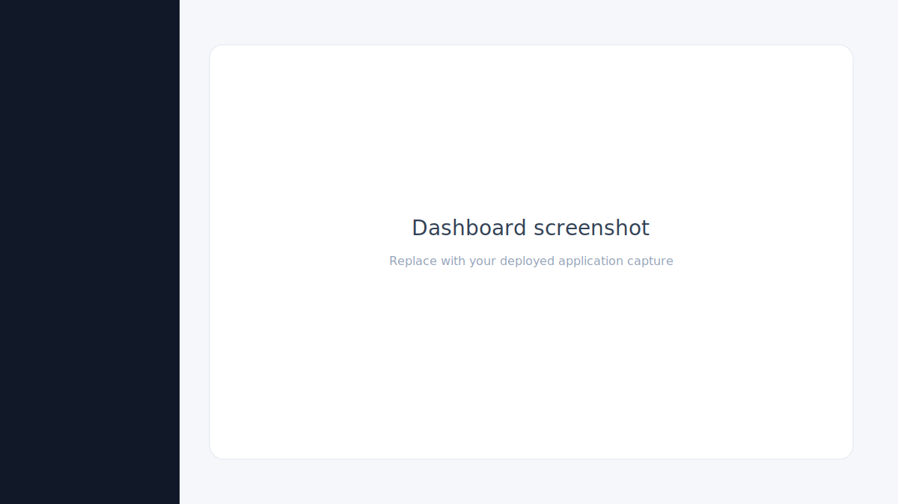
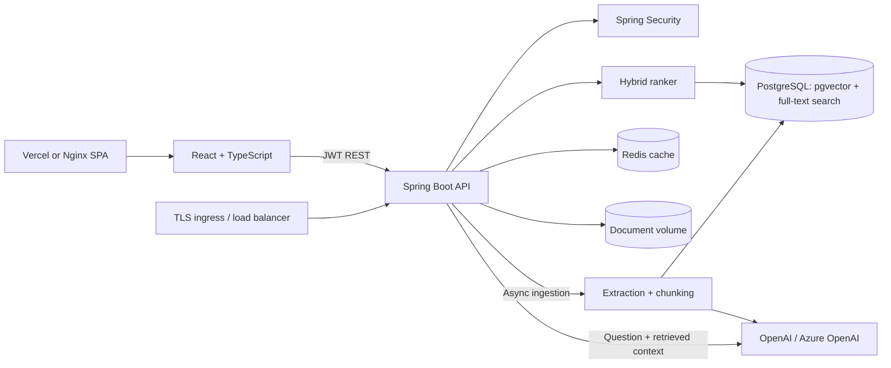
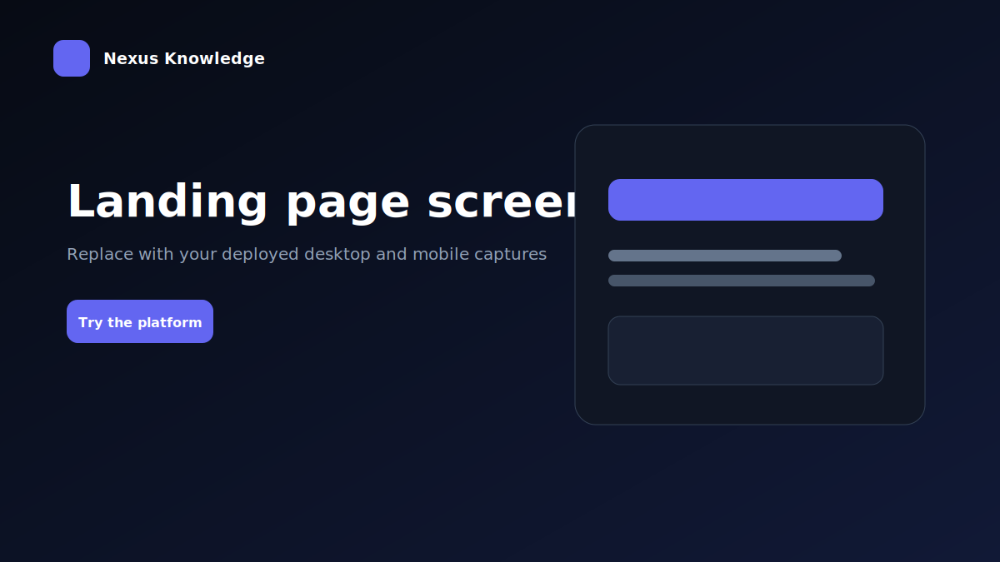
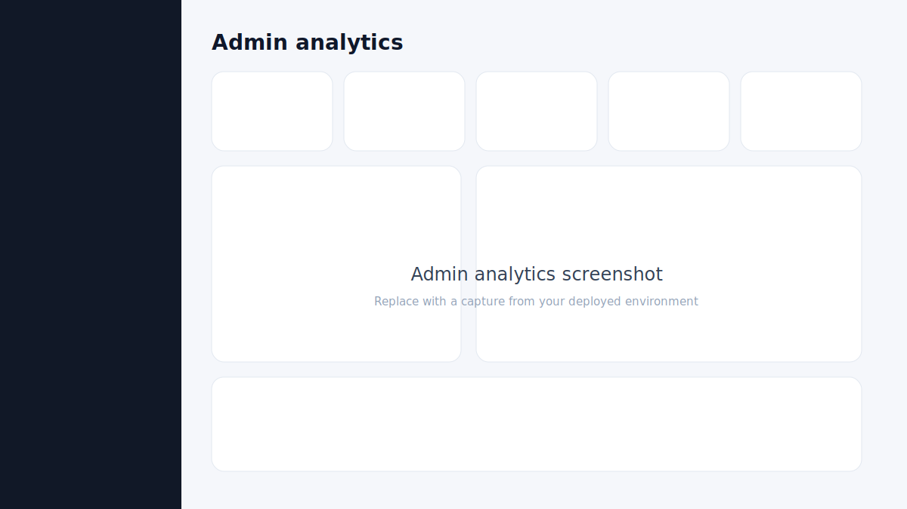
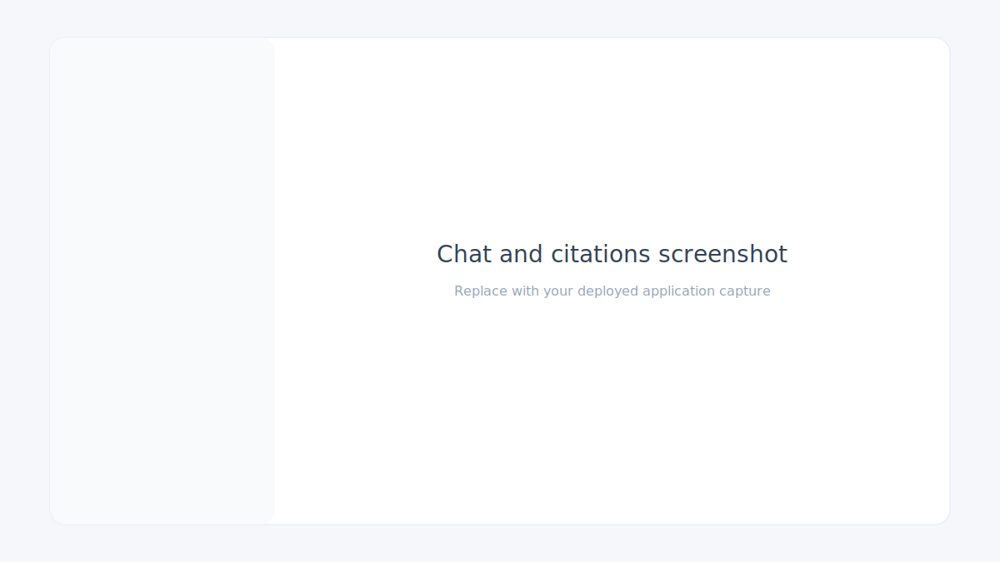

# Enterprise AI Knowledge Platform

A production-style, full-stack retrieval-augmented generation (RAG) platform for securely uploading company documents and asking source-grounded questions. The application provides user-isolated document search, persisted conversation history, inline citations, and an administrator view.

[Live demo (local Docker)](http://localhost:3000) · [API health](http://localhost:8080/actuator/health)

> Deployment owners can replace the local demo URL above with the public Vercel or container ingress URL.



## Features

- Email/password signup and login with signed JWT access tokens
- `ADMIN` and `USER` role-based authorization
- Multiple owner-isolated workspaces with a persistent frontend switcher
- PDF, TXT, and DOCX uploads up to 25 MB
- Asynchronous ingestion with explicit upload, processing, ready, and failed states
- Failed-ingestion diagnostics and owner-authorized retry support
- Hybrid PostgreSQL retrieval combining `pgvector` cosine similarity and indexed full-text search
- OpenAI and Azure OpenAI compatible embedding/chat requests
- Source-grounded answers with document, page (for newly processed PDFs), chunk, excerpt, and ranking metadata
- Token-by-token AI responses over Server-Sent Events, with cancellation and JSON fallback
- User-scoped chat sessions and message history
- Admin analytics for users, workspaces, document status, conversations, activity, failures, and estimated token volume
- Redis-backed caching, Flyway migrations, health checks, Docker Compose, and GitHub Actions
- Redis-backed per-user limits for costly chat and document-upload operations
- Structured JSON request logs with correlation IDs, user UUIDs, latency, and safe async context propagation
- Responsive React dashboard built with TypeScript and Tailwind CSS
- Public SaaS landing page, persistent dark/light mode, professional responsive navigation, and branded favicon
- Markdown/GFM answers with tables, lists, inline code, styled code blocks, copy controls, and streaming feedback
- Expandable source cards with page metadata, relevance score, evidence preview, and copyable citations
- Drag-and-drop uploads with progress, document preview/rename/delete/retry, and confirmation dialogs
- Conversation rename/delete/regenerate/copy controls plus `Enter`, `Shift+Enter`, and `Cmd/Ctrl+K` shortcuts
- Consistent skeleton, empty, error, success-toast, and destructive-confirmation states

## Architecture



### Architecture at a glance

1. The React SPA authenticates with the Spring Boot API and sends the JWT on protected REST and SSE requests.
2. Spring Security validates the JWT, resolves the current database-backed role, attaches a correlation ID, and applies Redis-backed per-user rate limits before controller execution.
3. Workspace authorization is enforced in the service layer before document, retrieval, chat, or history repositories are queried.
4. Uploads are durably stored and committed before bounded background workers extract text, create overlapping chunks, request embeddings, and write pgvector/full-text indexes.
5. Chat requests create an embedding, execute workspace-scoped semantic and keyword retrieval, combine both rankings, and send only the selected context to the AI provider.
6. Answers stream over SSE, include citation metadata, and are persisted only after successful completion.
7. PostgreSQL is the source of truth, Redis stores short-lived cache and rate-limit state, and container stdout carries structured logs for aggregation.

### Deployment architecture

The frontend can be deployed as a Vercel SPA (using `frontend/vercel.json`) or as the included Nginx container. The Spring Boot container runs behind an HTTPS ingress, persists relational/vector data in managed PostgreSQL with pgvector, connects to managed Redis such as Upstash over TLS, and stores provider credentials in the deployment secret manager. The local Compose topology mirrors those service boundaries and adds a persistent upload volume for demonstration.

Documents and conversations belong to a workspace. Uploads are stored on a persistent volume, while chunk content, PostgreSQL `tsvector` terms, and 1,536-dimensional embeddings are stored in PostgreSQL. Each question runs through semantic and keyword retrieval over only the selected workspace's ready documents. Their normalized signals are merged into a configurable hybrid score, and the top passages are sent to the configured model. Both the answer and detailed citation metadata are persisted.

Every account receives a default workspace and can create additional ones. Normal users can list and access only workspaces they own. Administrators can enumerate and switch into every workspace for platform support and auditing. Workspace authorization is enforced in the service layer before document, ingestion, retrieval, or chat repositories are queried.

## Repository layout

```text
.
├── backend/
│   ├── src/main/java/com/enterpriseai/knowledge/
│   │   ├── config/       # Security, properties, admin bootstrap
│   │   ├── controller/   # REST resources and error handling
│   │   ├── domain/       # JPA entities and enums
│   │   ├── dto/          # API contracts
│   │   ├── repository/   # JPA repositories
│   │   ├── security/     # JWT filter and token service
│   │   └── service/      # Auth, ingestion, vector search, RAG
│   ├── src/main/resources/db/migration/
│   ├── Dockerfile
│   └── pom.xml
├── frontend/
│   ├── src/components/
│   ├── src/context/
│   ├── src/pages/
│   ├── Dockerfile
│   └── package.json
├── .github/workflows/ci.yml
└── docker-compose.yml
```

## Quick start with Docker

Requirements: Docker Engine with Docker Compose v2.

```bash
cp .env.example .env
# Set JWT_SECRET and optionally OPENAI_API_KEY in .env
docker compose up --build
```

Open [http://localhost:3000](http://localhost:3000). The development administrator is configured in `.env`:

```text
Email:    ADMIN_EMAIL
Password: ADMIN_PASSWORD
```

The values copied from `.env.example` are `admin@example.com` and `change-this-admin-password`. Change the password and `JWT_SECRET` before using the stack outside local development. New signups receive the `USER` role.

The stack can run without an AI key: it uses deterministic local embeddings for development and returns the retrieved citations with a configuration notice. Set `OPENAI_API_KEY` to enable generated answers and provider embeddings.

Verify the running stack:

```bash
docker compose ps
curl --fail http://localhost:8080/actuator/health
curl --fail http://localhost:3000/health
```

All four services should report healthy. Stop the stack with `docker compose down`; add `-v` only when you intentionally want to erase PostgreSQL, Redis, and uploaded-file volumes.

### Key environment variables

| Variable | Purpose |
|---|---|
| `APP_ENVIRONMENT` | Environment label included in every structured log event |
| `REDIS_HOST` / `REDIS_PORT` | Redis endpoint; Compose defaults to the local `redis:6379` service |
| `REDIS_PASSWORD` | Optional Redis password; leave empty for the local Docker service |
| `REDIS_SSL_ENABLED` | Enables TLS for managed Redis providers such as Upstash (default `false`, production profile default `true`) |
| `JWT_SECRET` | HMAC signing secret; use at least 32 random characters |
| `CORS_ALLOWED_ORIGIN_PATTERNS` | Comma-separated origins allowed to call the API directly |
| `OPENAI_API_KEY` | Enables provider embeddings and generated answers |
| `AI_PROVIDER` | `openai` or `azure` |
| `OPENAI_BASE_URL` | OpenAI-compatible API or Azure resource endpoint |
| `OPENAI_CHAT_MODEL` | Model name, or Azure chat deployment name |
| `OPENAI_EMBEDDING_MODEL` | Embedding model, or Azure embedding deployment name |
| `ADMIN_EMAIL` / `ADMIN_PASSWORD` | Creates the bootstrap administrator when absent |
| `EMBEDDING_DIMENSIONS` | Embedding width; must match the migration schema |
| `RAG_TOP_K` | Number of hybrid-ranked chunks supplied to the model (default `5`) |
| `RAG_VECTOR_WEIGHT` | Semantic similarity contribution (default `0.7`) |
| `RAG_KEYWORD_WEIGHT` | Full-text relevance contribution (default `0.3`) |
| `RAG_MINIMUM_SCORE` | Minimum hybrid score required for model context/citations (default `0.15`) |
| `RATE_LIMIT_CHAT_PER_MINUTE` | Maximum combined streaming and fallback chat requests per user per minute (default `20`) |
| `RATE_LIMIT_UPLOADS_PER_HOUR` | Maximum new document uploads per user per hour (default `30`) |

## AI provider configuration

### OpenAI

```env
AI_PROVIDER=openai
OPENAI_API_KEY=sk-...
OPENAI_BASE_URL=https://api.openai.com/v1
OPENAI_CHAT_MODEL=gpt-4o-mini
OPENAI_EMBEDDING_MODEL=text-embedding-3-small
```

### Azure OpenAI

For Azure, model variables are deployment names and the base URL is the Azure resource endpoint:

```env
AI_PROVIDER=azure
OPENAI_API_KEY=...
OPENAI_BASE_URL=https://YOUR-RESOURCE.openai.azure.com
OPENAI_CHAT_MODEL=YOUR-CHAT-DEPLOYMENT
OPENAI_EMBEDDING_MODEL=YOUR-EMBEDDING-DEPLOYMENT
AZURE_OPENAI_API_VERSION=2024-10-21
```

The database schema is fixed at 1,536 dimensions. Use a compatible embedding deployment or change both `EMBEDDING_DIMENSIONS` and the Flyway vector definition before initializing a new database.

When `APP_ENVIRONMENT=production`, startup fails fast if the development JWT secret, example administrator password, wildcard origin, or localhost CORS origin is still configured.

## Upstash Redis configuration

Use the host, port, and password shown in the Upstash Redis dashboard. Upstash connections require TLS:

```env
SPRING_PROFILES_ACTIVE=prod
REDIS_HOST=YOUR-DATABASE.upstash.io
REDIS_PORT=6379
REDIS_PASSWORD=YOUR-UPSTASH-PASSWORD
REDIS_SSL_ENABLED=true
```

The application uses a Lettuce standalone connection with a bounded command timeout. Password authentication is applied only when `REDIS_PASSWORD` is non-empty, and TLS is enabled only when `REDIS_SSL_ENABLED=true`. The local Compose Redis service continues to use `redis:6379` without authentication or TLS.

## Local development

Start infrastructure:

```bash
docker compose up -d postgres redis
```

Run the backend with Java 17 and Maven 3.9+:

```bash
cd backend
export JWT_SECRET="a-local-secret-with-at-least-32-characters"
mvn spring-boot:run
```

Run the frontend with Node.js 20+:

```bash
cd frontend
npm install
npm run dev
```

The Vite server runs at `http://localhost:3000` and proxies `/api` to `http://localhost:8080`.

## API endpoints

All endpoints except authentication and health require `Authorization: Bearer <token>`.

| Method | Endpoint | Role | Purpose |
|---|---|---|---|
| `POST` | `/api/auth/signup` | Public | Create a user account |
| `POST` | `/api/auth/login` | Public | Authenticate and receive a JWT |
| `GET` | `/api/workspaces` | User | List accessible workspaces; admins receive all |
| `POST` | `/api/workspaces` | User | Create an owned workspace |
| `GET` | `/api/workspaces/{workspaceId}/documents` | Workspace access | List workspace documents |
| `POST` | `/api/workspaces/{workspaceId}/documents` | Workspace access | Upload a multipart `file` |
| `POST` | `/api/workspaces/{workspaceId}/documents/{id}/retry` | Workspace access | Retry a failed ingestion |
| `PATCH` | `/api/workspaces/{workspaceId}/documents/{id}` | Workspace access | Rename a document without changing its file type |
| `GET` | `/api/workspaces/{workspaceId}/documents/{id}/preview` | Workspace access | Stream the original document for an authorized inline preview |
| `DELETE` | `/api/workspaces/{workspaceId}/documents/{id}` | Workspace access | Delete a document and chunks |
| `POST` | `/api/workspaces/{workspaceId}/chats/ask` | Workspace access | Ask a question; optionally pass `sessionId` |
| `POST` | `/api/workspaces/{workspaceId}/chats/stream` | Workspace access | Stream an answer as named SSE events |
| `GET` | `/api/workspaces/{workspaceId}/chats` | Workspace access | List the current user's workspace sessions |
| `GET` | `/api/workspaces/{workspaceId}/chats/{id}` | Session owner | Retrieve messages and citations |
| `PATCH` | `/api/workspaces/{workspaceId}/chats/{id}` | Session owner | Rename a conversation |
| `POST` | `/api/workspaces/{workspaceId}/chats/{id}/regenerate` | Session owner | Replace the latest assistant answer using fresh retrieval |
| `DELETE` | `/api/workspaces/{workspaceId}/chats/{id}` | Session owner | Delete a chat session |
| `GET` | `/api/admin/stats` | Admin | Platform statistics |
| `GET` | `/api/admin/analytics` | Admin | Operational analytics, recent activity, failed jobs, and token estimates |
| `GET` | `/api/admin/users` | Admin | List accounts |
| `GET` | `/api/admin/documents` | Admin | List all documents |
| `GET` | `/api/admin/workspaces` | Admin | List all workspaces and owners |
| `GET` | `/actuator/health` | Public | Service health |

Example question:

```bash
curl -X POST http://localhost:8080/api/workspaces/$WORKSPACE_ID/chats/ask \
  -H "Authorization: Bearer $TOKEN" \
  -H "Content-Type: application/json" \
  -d '{"question":"What is our data retention policy?"}'
```

### Streaming chat protocol

The React client sends the same `AskRequest` JSON to `POST /api/workspaces/{workspaceId}/chats/stream` with `Accept: text/event-stream`. The endpoint emits:

| Event | Payload | Meaning |
|---|---|---|
| `sources` | `{ "citations": [...] }` | Retrieved context is ready |
| `delta` | `{ "content": "..." }` | Incremental answer text |
| `done` | `{ "sessionId": "...", "citations": [...] }` | Full answer was saved successfully |
| `error` | `{ "message": "..." }` | Stream failed or produced no answer |

Client cancellation aborts the provider connection and does not persist a partial assistant response. If streaming transport is unavailable before any answer text arrives, the client retries once through the workspace-scoped `/api/workspaces/{workspaceId}/chats/ask` JSON endpoint. OpenAI-compatible providers are requested with `stream: true`; Chat Completions streams return data-only SSE chunks whose text is read from `choices[0].delta.content`.

## Hybrid retrieval

Every question executes two workspace-scoped candidate searches:

1. Semantic search orders chunks by pgvector cosine distance.
2. Keyword search normalizes the question into English lexemes, joins them as an OR-query, and ranks matching generated `tsvector` values with `ts_rank_cd`. The column is backed by a GIN index. OR semantics tolerate natural-language filler words while rewarding chunks that match more query terms.

The candidate sets are merged by chunk ID. Cosine similarity is clamped to `[0, 1]`, PostgreSQL keyword relevance is normalized against the strongest keyword match, and the final score is:

```text
hybridScore =
  (vectorWeight × vectorScore + keywordWeight × normalizedKeywordScore)
  ÷ (vectorWeight + keywordWeight)
```

Chunks below `RAG_MINIMUM_SCORE` are discarded so unrelated or zero-score passages never become model context or citations. The highest remaining `RAG_TOP_K` chunks are returned. Citation JSON includes `documentName`, nullable `pageNumber`, `chunkIndex`, `excerpt`, `score`, `vectorScore`, `keywordScore`, and `retrievalMethod`. PDF page numbers are captured during page-aware ingestion; documents processed before the hybrid-search migration retain `null` page numbers until they are uploaded and processed again.

## Database and processing lifecycle

Flyway creates `app_users`, `workspaces`, `documents`, `document_chunks`, `chat_sessions`, and `chat_messages`, enables `vector`, and adds both an HNSW cosine index and a GIN full-text index. Migration V4 creates one default workspace per existing user and backfills existing documents and sessions before applying non-null foreign keys. Chat sessions use optimistic locking to prevent concurrent updates from silently overwriting history.

Uploads are validated and copied to durable storage first. The document row is saved as `UPLOADED`, transitioned to `PROCESSING`, and returned immediately with HTTP `202 Accepted`; extraction, page-aware chunking, embedding generation, and index writes continue on the configured background executor.

```text
UPLOADED → PROCESSING → READY
                      ↘ FAILED → retry → PROCESSING
```

The UI inserts the processing row immediately and polls while work is active. A failed job removes partial chunks, stores a concise `errorMessage`, and exposes a retry action that reuses the original file. Retry is accepted only for `FAILED` documents and transitions the row atomically to prevent duplicate retries. Both semantic and keyword retrieval queries filter on `documents.status = 'READY'`, so uploaded, processing, and failed content can never enter chat context. Deleting a document removes its chunks through cascading foreign keys and removes its stored file.

## Security notes

- Passwords are BCrypt hashed and are never returned by the API.
- JWTs are stateless and expire after 24 hours by default.
- Workspace access is checked before every scoped operation; unauthorized workspace IDs return `404`.
- Retrieval queries filter by workspace UUID and include only `READY` documents.
- Admin routes are enforced both by route policy and method ownership rules.
- Uploaded names are normalized; server-side storage names are random UUIDs.
- Authentication and validation failures use a consistent JSON error contract.
- Request logging records metadata only; passwords, JWTs, upload bodies, document text, and AI prompts are never read or logged by the tracing filter.
- AI HTTP calls use bounded connection/read timeouts and do not hold database transactions open.
- Authenticated chat and document-upload requests use atomic Redis counters. Exceeded limits return `429 Too Many Requests` with `Retry-After`, `X-RateLimit-Limit`, and `X-RateLimit-Remaining` headers. Ingestion retries are not counted as new uploads.
- For production, use a secrets manager, TLS at the ingress, restricted CORS origins, malware scanning, rate limiting, centralized logs, and object storage instead of a local volume.

### Production deployment checklist

- Set `APP_ENVIRONMENT=production`.
- Generate a unique 32+ character `JWT_SECRET` and rotate all example credentials.
- Set an explicit HTTPS `CORS_ALLOWED_ORIGIN_PATTERNS` value.
- Inject AI and database credentials through a secrets manager rather than a committed environment file.
- Terminate TLS at a trusted ingress and restrict direct database/Redis port exposure.
- Replace the local upload volume with encrypted object storage and add antivirus/content-disarm scanning.
- Forward JSON stdout logs to the organization’s log platform and alert on 5xx responses, failed ingestion, Redis limiter failures, and queue saturation.
- Configure database backups, retention, restore tests, and provider-budget alerts.

## Logging and request tracing

The backend writes newline-delimited JSON logs to standard output for container-native collection. Every HTTP request receives an `X-Correlation-ID`; a caller-provided ID is preserved only when it contains 8–64 safe alphanumeric, dot, underscore, or hyphen characters. Otherwise, the backend generates a UUID.

Request completion events include:

- `correlationId`
- authenticated `userId` when available
- `httpMethod` and `endpoint`
- `statusCode` and `latencyMs`
- application and environment labels

The same MDC context is propagated into asynchronous ingestion and streaming tasks. Exception logs include the error class and stack trace where appropriate, but the tracing layer never reads request bodies, authorization headers, uploaded content, or AI prompts.

API error bodies include the same `correlationId`, and the frontend renders it as a **Support ID**. Use that value to find one request across services:

```bash
docker compose logs backend | jq 'select(.correlationId == "SUPPORT_ID")'
```

You can also supply a trace ID while reproducing an issue:

```bash
curl http://localhost:8080/api/workspaces \
  -H "Authorization: Bearer $TOKEN" \
  -H "X-Correlation-ID: support-case-123"
```

## CI and validation

The GitHub Actions workflow:

1. Tests and packages the Spring Boot application.
2. Type-checks and builds the React application.
3. Validates Compose and builds both application images.

Run the same checks locally:

```bash
(cd backend && mvn verify)
(cd frontend && npm ci && npm run lint && npm run typecheck && npm run build)
docker compose config --quiet
```

Backend coverage includes authentication behavior, workspace ownership, admin RBAC, document validation and queue failure handling, extraction and ingestion transitions, hybrid retrieval ranking, chat persistence/stream cancellation, Redis rate limiting, production configuration guards, and request correlation.

## Screenshot placeholders







Recommended release captures:

- Public landing page in desktop and mobile layouts
- Light and dark authenticated dashboards
- Document ingestion states and preview controls
- Streaming chat with Markdown and expanded citation evidence
- Administrator analytics and failed-ingestion table

The admin analytics page is available at `/admin` to users with the `ADMIN` role. Its token total combines stored ingestion chunk estimates with an approximation of persisted chat text (`characters ÷ 4`); it is an operational indicator rather than a provider billing total.

Replace the SVG files under `docs/screenshots/` with captures from the deployed environment when preparing release documentation.

## Resume-ready project summary

**Enterprise AI Knowledge Platform — Spring Boot, React, PostgreSQL/pgvector, Redis, OpenAI, Docker**

Built a demo-ready, multi-tenant RAG SaaS with JWT/RBAC security, isolated workspaces, asynchronous PDF/TXT/DOCX ingestion, pgvector plus PostgreSQL full-text hybrid retrieval, source-grounded streaming AI chat, persisted conversation history, admin analytics, Redis rate limiting/caching, structured request tracing, Flyway migrations, Docker Compose, and GitHub Actions. Delivered a responsive dark/light React product experience with Markdown answers, expandable citations, upload progress, document preview/rename/retry, conversation regeneration, keyboard shortcuts, and authorization-focused automated tests.

## Remaining limitations

- The development fallback embedding is deterministic but is not compatible with provider embeddings; documents must be re-indexed after switching embedding providers.
- Token analytics are estimates derived from stored chunk estimates and chat character counts, not provider billing records.
- Local-volume uploads are suitable for a single-node demonstration; production should use encrypted object storage with malware scanning.
- JWTs are stored in browser local storage and cannot be revoked individually before expiration. A higher-assurance deployment should use short-lived access tokens, rotating refresh tokens in secure HTTP-only cookies, and a revocation strategy.
- Background work uses the application process rather than an external durable queue. Failed dispatch is detected and retryable, but multi-node/high-volume deployments should use a durable broker and idempotent workers.
- Chat citations are retrieval evidence, not a guarantee that every generated sentence is entailed; production deployments should add RAG evaluation, moderation, and provider usage monitoring.
- PDF and text files usually preview inline; browser support for DOCX varies and may download the authorized original instead.
